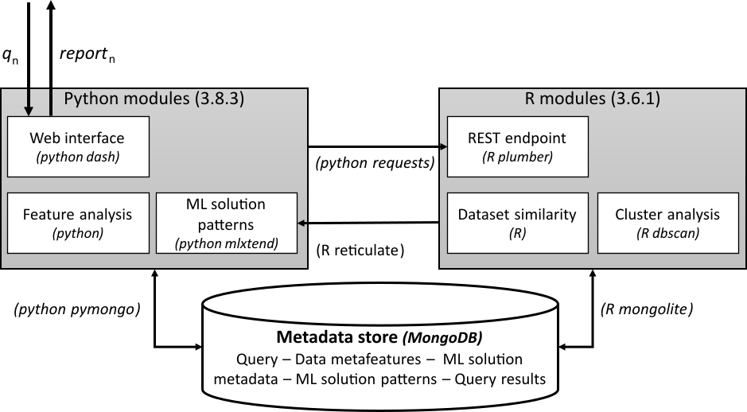

# AssistML: An alternative to AutoML recommending ML Solutions

> 21.04.2022

## Abstract

The adoption of machine learning (ML) in organizations is characterized by the use of multiple ML software components. When building ML systems out of these software components, citizen data scientists face practical requirements which go beyond the known challenges of ML, e. g., data engineering or parameter optimization. They are expected to quickly identify ML system options that strike a suitable trade-off across multiple performance criteria. These options also need to be understandable for non-technical users. Addressing these practical requirements represents a problem for citizen data scientists with limited ML experience. This calls for a concept to help them identify suitable ML software combinations. Related work, e. g., AutoML systems, are not responsive enough or cannot balance different performance criteria.

This paper explains how AssistML, a novel concept to recommend ML solutions, i. e., software systems with ML models, can be used as an alternative for predictive use cases. Our concept collects and preprocesses metadata of existing ML solutions to quickly identify the ML solutions that can be reused in a new use case. We implement AssistML and evaluate it with two exemplary use cases. Results show that AssistML can recommend ML solutions in line with users' performance preferences in seconds. Compared to AutoML, AssistML offers citizen data scientists simpler, intuitively explained ML solutions in considerably less time. Moreover, these solutions perform similarly or even better than AutoML models. 

## Repository organization

- **python-modules**: Main script is assist-dashboard.py
- **r-api**: R modules are located in this directory. Main script is assist.R
- **repository**: Contains metadata to recreate the metadata repository
- **source-code**: Contains the corresponding source code of the ML solutions described in the metadata repository.
- **Experimental_Data.pdf**: Includes the full list of ML solutions recommended by AssistML for four different use cases, as well as their corresponding adapted ML solutions obtained by reusing the source code.  

## Reproducibility

The following steps need to be carried out to run the prototype of AssistML and reproduce the evaluation setup:  

1. Clone the repository.
2. Satisfy dependencies.
3. Create repository in Mongo with the provided data.
4. Launch the API (”assist.R”) and web interface (”assist dashboard.py”).
5. In a web browser go to http://localhost:8050
6. To reproduce evaluation setting q-steel-20, watch the video q-steel-20.mkv (see below).  Other evaluation settings can be reproduced in a
   similar manner.  

## System Requirements

- Ubuntu 18.04 host 
  - 2 CPUs at 2.5 GHz
  - 8 GB of memory 
  - 40 GB of disk space.  

## Demo Video

A demonstration video is provided: *[q-steel-20.mkv](q-steel-20.mkv)*

## Disclaimer

This is an experimental codebase, not ready for production. 

The contents of this repository are provided as-is, with no implied warranty.

No maintenance or support for applications of this codebase is provided.